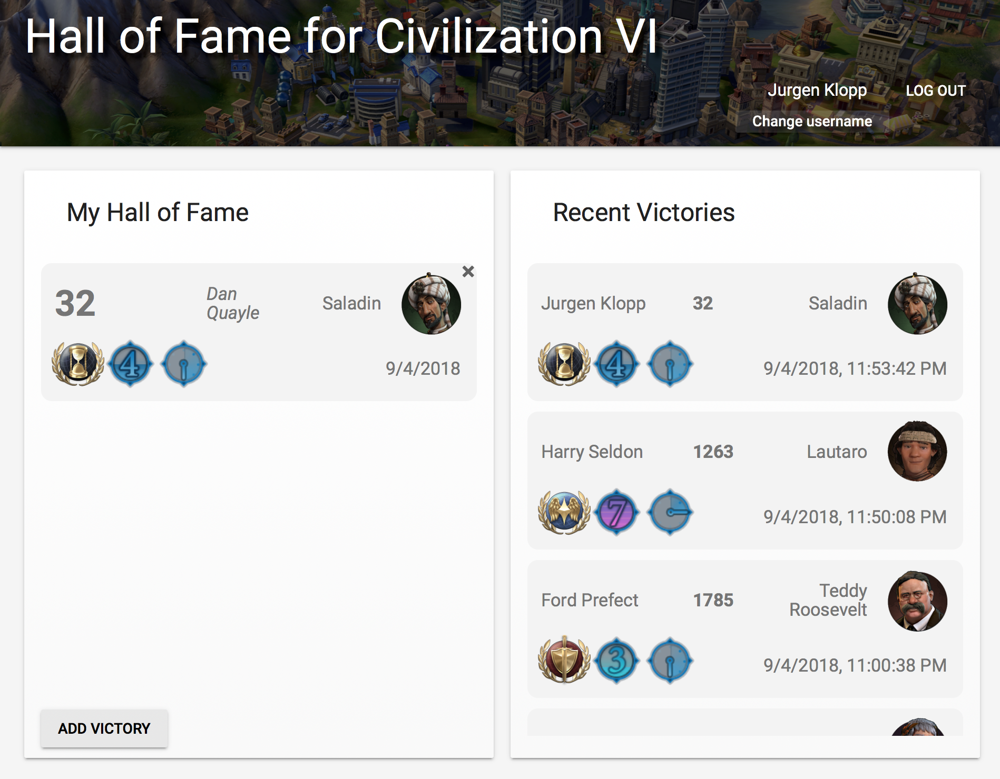

# Hall of Fame for Civilization VI

EDIT: Some time after I made this, Civ VI released an update with a Hall of Fame. I took down the FireBase app where this was hosted, so this repo is just for future reference.

I was disappointed that Civ VI has no Hall of Fame, so I made my own.

Features:
- Store and display your victories
- See a real-time stream of all public victories
- Choose whether to make your victories public or private
- Secure authentication and data storage with Google

## Screenshot

Made with FireBase.
